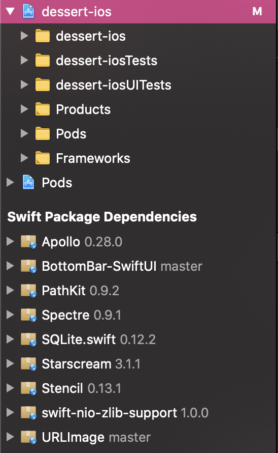
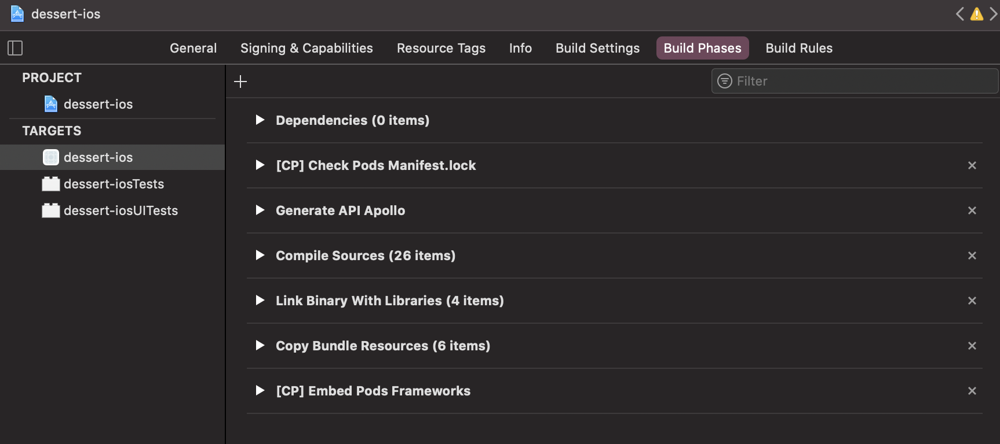
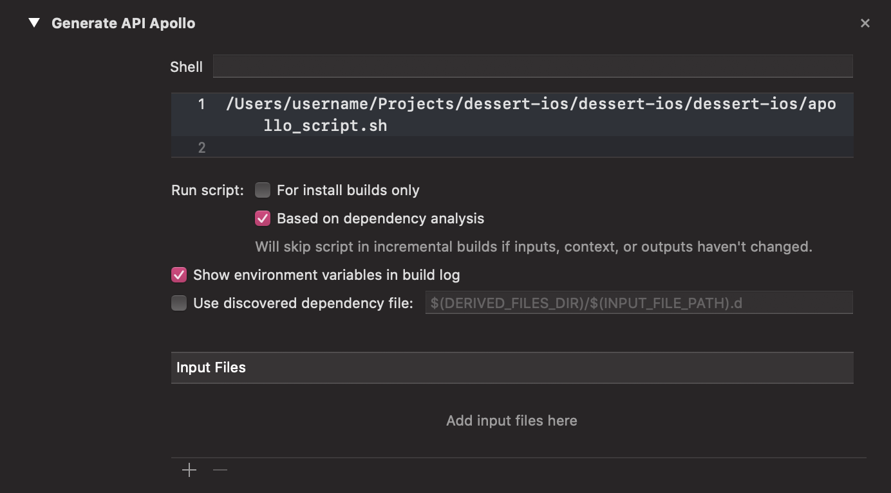

# dessert-ios

**The iOS application of Dessert**.

**Summary**
   * [Release](#release)
   * [Setup and Build](#setup-and-build)
   * [Push to Device](#push-to-device)

## Release

We don't have an iPhone in hand, but this application was still made for those of you who want to **check up on their Dessert modules on your iPhone!**

Follow the instructions below to setup and build the project for your phone.

## Setup and build

Prerequisites:

- MacOS (Tested on MacOS Catalina 10.15.7)
- XCode (Tested on XCode 12.2)

In order to open the project in XCode, follow those steps:

0. clone the project from [GitHub](https://github.com/dessert-wasm/dessert-ios).
1. open `Finder`
2. go to the folder `dessert-ios`
3. open the file `dessert-ios.xcworkspace`

> Be careful, don't open the `dessert-ios.xcodeproj` by mistake!

4. wait for the project to be loaded into XCode (and dependencies to be installed)

5. select the file `dessert-ios.xcodeproj` as per the above screenshot.

6. select the section `Generate API Apollo` in the tab `Build Phases` for the target `dessert-ios`

7. change the path of the script `apollo.sh` script accordingly

8. you can now build the `dessert-ios` project!

> Be sure to select a phone target, such as the `iPhone 11`.
 
## Push to device

Check the Apple documentation [here](https://developer.apple.com/documentation/xcode/running_your_app_in_the_simulator_or_on_a_device) to push the application to your device.
